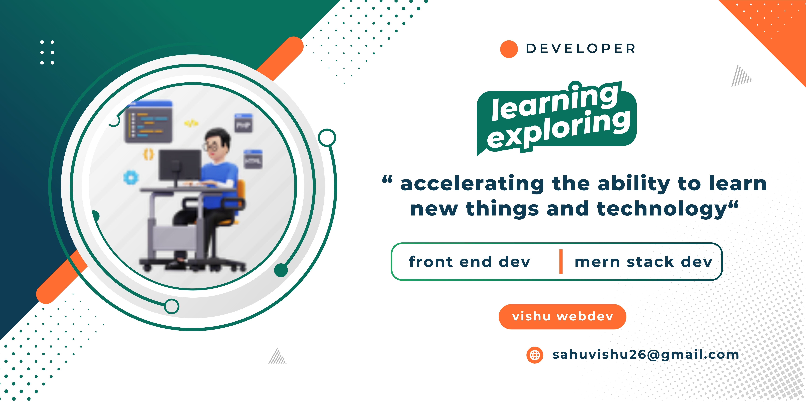

<h1 align="center">Hi 👋, I'm vishu Jsr</h1>
<h3 align="center">A passionate Full Stack Mern Developer</h3>

  

# 💫 About Me:
🔭 I’m currently working on logixhunt 🌱 I’m currently learning Typescript ,angular.js , Data structure and algorithm 👨‍💻 All of my projects are available at https://portfolio2-beta-ten.vercel.app/ 📫 How to reach me sahuvishu26@gmail.com ⚡ Fun fact joking and enjoying always upskilling and exploring the new things and tools

## 🌐 Socials:
   

# 💻 Tech Stack:
                    
# 📊 GitHub Stats:
 
 

## 🏆 GitHub Trophies

### ✍️ Random Dev Quote

### 🔝 Top Contributed Repo

### 😂 Random Dev Meme

---

  ## 💰 You can help me by Donating
   

  
<!-- Proudly created with GPRM ( https://gprm.itsvg.in ) -->
